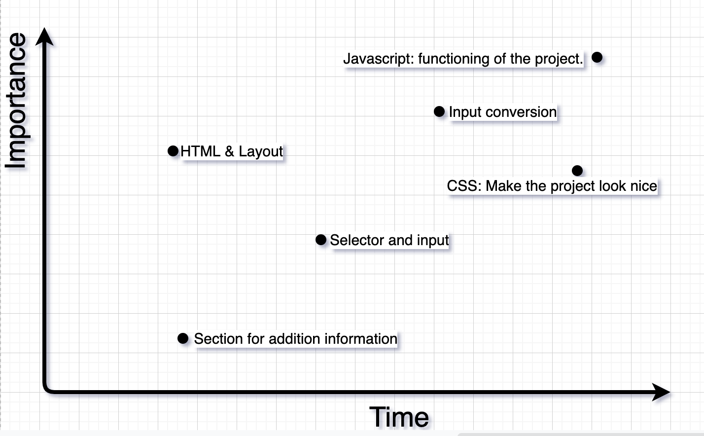

# Project Overview

## Project Name

Change My ¢hange

##

## Project Description

This is a currency converter. We all know the currency value is different throughout the world. User will be able to convert U.S dollar (USD) to other currency values. So before booking a flight lets see how much our money will be worth somewhere else.

##

## API and Data Sample

```
{
    "result": "success",
    "documentation": "https://www.exchangerate-api.com/docs",
    "terms_of_use": "https://www.exchangerate-api.com/terms",
    "time_zone": "UTC",
    "time_last_update": 1585872001,
    "time_next_update": 1585958521,
    "base": "USD",
    "conversion_rates": {
        "USD": 1,
        "AED": 3.6720,
        "ARS": 64.5116,
```

Here is the link to my API: https://prime.exchangerate-api.com/v5/ea19256df9d432e21c8cfc0e/latest/USD

##

## Wireframes

https://wireframe.cc/pro/pp/45d53fe9c330387

##

### MVP/PostMVP - 5min

#### MVP

- Think of a topic and search for a working API
- Create a responsive layout
- Add additional information about currency value
- Allow user to select currency types
- Allow user to input currency values
- Show results of the conversion

#### PostMVP

- Make currency type selection a dropdown box
- Additional information should expand
- Add additional page for... (Haven't decided yet)

##

## Project Schedule

| Day        | Deliverable                                               | Status     |
| ---------- | --------------------------------------------------------- | ---------- |
| April 6th  | Pitch my project and get approval                         | Incomplete |
| April 7th  | Complete HTML, basic CSS, start Javascript                | Incomplete |
| April 8th  | Javascript                                                | Incomplete |
| April 9th  | Complete CSS, finishing touch, PostMVP (if there is time) | Incomplete |
| April 10th | Presentation                                              | Incomplete |

##

## Priority Matrix



##

## Timeframes

| Component                   | Priority | Estimated Time | Time Invested | Actual Time |
| --------------------------- | :------: | :------------: | :-----------: | :---------: |
| HTML and basic CSS          |    H     |      3hrs      |      3hrs      |     3hrs     |
| Page layout                 |    M     |      1hr       |      1hrs      |     1hrs     |
| Currency selector           |    H     |      3hrs      |      hrs      |     hrs     |
| Currency input              |    H     |      3hrs      |      hrs      |     hrs     |
| Conversion results          |    H     |      3hrs      |      hrs      |     hrs     |
| Link API and store data     |    H     |      3hrs      |      hrs      |     hrs     |
| Javascript/DOM manipulation |    H     |      8hrs      |      hrs      |     hrs     |
| Finish CSS                  |    M     |      8hrs      |      hrs      |     hrs     |
| PostMVP                     |    L     |      4hrs      |      hrs      |     hrs     |
| Unexpected Debugging        |    H     |      4hrs      |      hrs      |     hrs     |
| Total                       |          |     40hrs      |      hrs      |     hrs     |

##

## Code Snippet

Use this section to include a brief code snippet of functionality that you are proud of an a brief description

```
function reverse(string) {
	// here is the code to reverse a string of text
}
```

##

## Change Log

Use this section to document what changes were made and the reasoning behind those changes.
